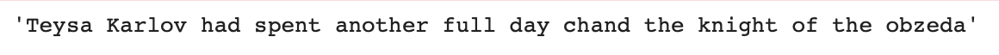

# NLP-Desafíos

En este repositorio se encuentran los desafíos de la cátedra Procesamiento Natural del Lenguaje  de la Carrera Especialización en Inteligencia Artificial de la Universidad de Buenos Aires.

## Desafío 1

**1**. Se tomaron 5 documentos al azar y se medió la similaridad con el resto. Luego se estudió los 5 documentos más similares a cada uno de ellos según el contenido del texto y la etiqueta de clasificación. En la figura se observa que todos los documentos con mayor similaridad tienen la misma etiqueta de clasificación.

**2**. Se entrenaron modelos de clasificación Naïve Bayes para maximizar el desempeño de clasificación(f1-score macro) en el conjunto de datos de test. Se probaron diferentes parámetros de instanciación del vectorizador y de los modelos. Se usaron modelos de Naïve Bayes Multinomial y ComplementNB.

**3**. Se realizó la transpuesta de la matriz documento-término para obtener la matriz término-documento que puede ser interpretada como una colección de vectorización de palabras. Luego se estudió la similaridad entre palabras tomando 5 palabras y estudiando sus 5 más similares como se observa en la siguiente imagen:

## Desafío 2

Se crearon vectores propios con Gensim basado en un dataset propio formado con los dos primeros álbumes de Linkin Park (Hybrid Theory y Meteora).

Se probaron términos de interés como por ejemplo, "crawling" y se observaron las 10 palabras que más se relacionaban, según el espacio de embeddings, siendo estas:

Se visualiza la agrupación de los vectores donde en este caso se ven los términos que forman parte del estribillo de la canción In the End.

También se pueden visualizar en 3d.

También se pleantearon tests de analogías como el siguiente con los nombres y apellidos de los vocalistas de la banda:

## Desafío 3

Se dividió el desafío en 2 partes, una usando un modelo de lenguaje con tokenización por palabras y otra con tokenización por caracteres.

### Modelo de lenguaje con tokenización por palabras

#### Consigna
- Seleccionar un corpus de texto sobre el cual entrenar el modelo de lenguaje.
- Realizar el pre-procesamiento adecuado para tokenizar el corpus, estructurar el dataset y separar entre datos de entrenamiento y validación.
- Proponer arquitecturas de redes neuronales basadas en unidades recurrentes para implementar un modelo de lenguaje.
- Con el o los modelos que consideren adecuados, generar nuevas secuencias a partir de secuencias de contexto con las estrategias de greedy search y beam search determístico y estocástico. En este último caso observar el efecto de la temperatura en la generación de secuencias.

- #### Sugerencias
- Durante el entrenamiento, guiarse por el descenso de la perplejidad en los datos de validación para finalizar el entrenamiento. Para ello se provee un callback.
- Explorar utilizar SimpleRNN (celda de Elman), LSTM y GRU.
- rmsprop es el optimizador recomendado para la buena convergencia. No obstante se pueden explorar otros.

Se usó como dataset uno propio formado por las letras de todas las canciones de Linkin Park. Se lo preprocesó dividiendo el corpus en documentos, siendo estos cada uno de los versos.

Se exploraron diferentes modelos como SimpleRNN, LSTM, GRU, SimpleRNN Bidireccional, LSTM Bidireccional y GRU Bidireccional, donde el último de estos fue el que obtuvo mejores resultados con el menor valor de perplejidad y loss:

Se probó generar una secuencia, la letra de una canción 'I wanna run away and open up my' y completó correctamente con la palabra 'mind'.

También se usó Beamsearch y muestreo aleatorio, para la misma secuencia a completar pero esta vez con un término menos, 'I wanna run away and open up', dieron los siguente 5 resultados:

### Modelo de lenguaje con tokenización por caracteres

Se utilizó como dataset una historia de Magic The Gathering, llamada Family Values.

Se exploraron diferentes modelos como SimpleRNN, LSTM, GRU, donde el último de estos fue el que obtuvo mejores resultados con el menor valor de perplejidad y loss:

Utilizando como input en la generación de secuencias el siguiente extracto del corpus: 

'Teysa Karlov had spent another full day '

Se obervá que respondió con algo coherente, sienda la respuesta:

## Desafío 4
El objecto es utilizar datos disponibles del challenge ConvAI2 (Conversational Intelligence Challenge 2) de conversaciones en inglés. Se construirá un BOT para responder a preguntas del usuario (QA)

El modelo completo (encoder+decoder) para poder entrenar es:

Al entrenar la curva de accuracy para train y loss fue la siguiente:

Las inferencias obtenidas con el modelo entrenado fueron las siguientes:

## Desafío 5

